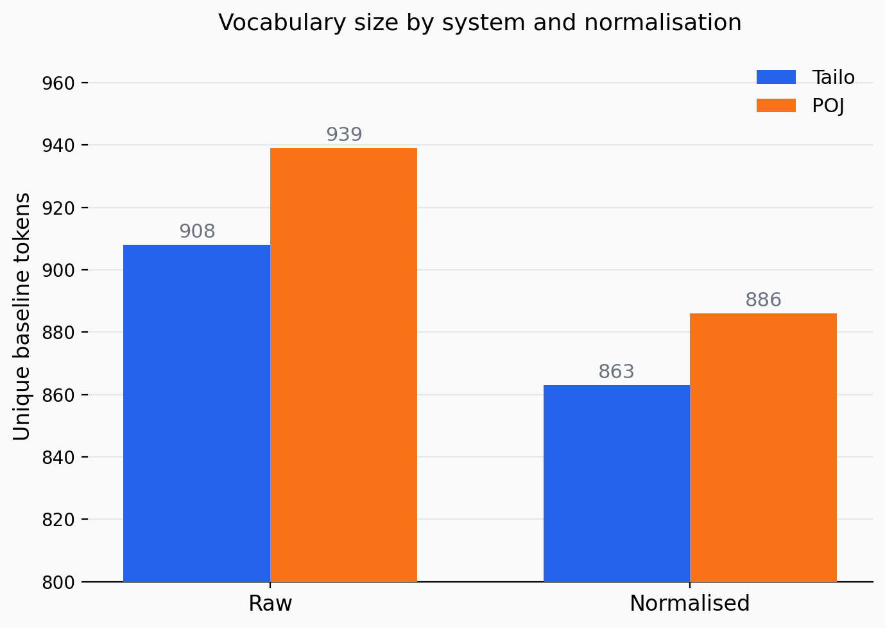
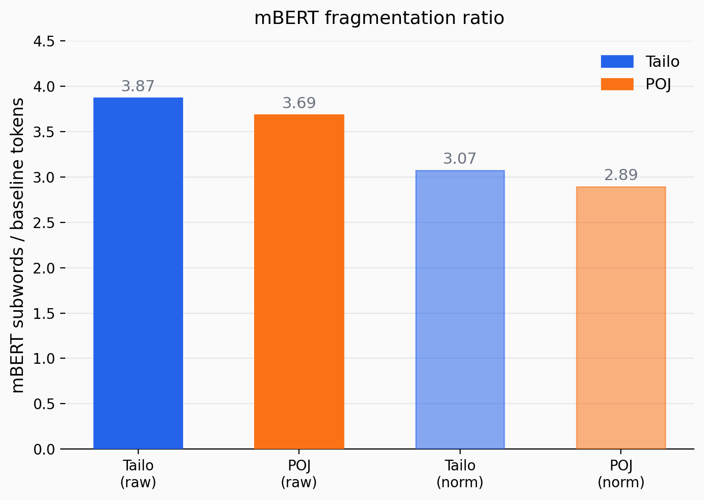

## Orthographic Variation and Tokenisation in Taiwanese Hokkien
 
Empirical analysis of how the choice of romanisation system — **Tâi-lô** vs **Pe̍h-ōe-jī (POJ)** — affects tokenisation behaviour in Taiwanese Hokkien, with a focus on subword fragmentation under multilingual BERT (mBERT).
 
Bachelor's thesis · Computational Linguistics · Eberhard-Karls-Universität Tübingen · 2026
 
---
 
## Research Question
 
To what extent do POJ and Tâi-lô produce divergent tokenisation statistics, and how do these differences interact with a mainstream subword tokeniser?
 
---
 
## Background
 
Taiwanese Hokkien has no single universally adopted orthographic standard. Two romanisation systems are in widespread use:
 
- **Pe̍h-ōe-jī (POJ)** — developed by 19th-century missionaries; used in religious texts, lexicographic resources, and some contemporary writing
- **Tâi-lô** — developed as a more systematic alternative; promoted for educational purposes and official teaching materials
Although both encode the same language, they differ in consonant spellings, tone marking, nasalisation markers, and hyphenation conventions. These differences are not merely typographic — they shift token boundaries and inflate apparent vocabulary size, which directly affects how NLP models process the language.
 
---
 
## Corpus
 
205 parallel sentences (each represented in both POJ and Tâi-lô), drawn from:
 
| Source | Sentences |
|---|---|
| Ministry of Education Taiwanese Hokkien Dictionary | 96 |
| New Taipei City instructional support system (新北輔導團) | 50 |
| Minpao — Tâi-gí World (contemporary journalism) | 45 |
| New Testament (POJ) | 5 |
| POJ geography textbook (1920) | 8 |
| Old Testament (POJ) | 1 |
| **Total** | **205** |
 
All romanised forms were reviewed and corrected by a professional Taiwanese language educator.
 
---
 
## Key Findings
 
### Baseline tokenisation
 
| Variant | Vocab size | Mean tokens/sentence |
|---|---|---|
| Tailo (raw) | 908 | 7.89 |
| POJ (raw) | 939 | 7.92 |
| Tailo (norm) | 863 | 7.89 |
| POJ (norm) | 886 | 7.92 |
 
Despite nearly identical sentence-level token counts, **vocabulary overlap between POJ and Tâi-lô is only 319 tokens** — roughly one third of the total vocabulary — even though the underlying corpus is fully parallel. This means orthographic variation alone is sufficient to fragment lexical evidence across corpora.
 
### mBERT subword fragmentation
 
| Variant | Mean mBERT tokens/sentence | Fragmentation ratio | Split rate |
|---|---|---|---|
| Tailo (raw) | 30.54 | 3.87 | 84.2% |
| POJ (raw) | 29.19 | 3.69 | 81.7% |
| Tailo (norm) | 24.24 | 3.07 | 69.6% |
| POJ (norm) | 22.89 | 2.89 | 66.8% |
 
**Fragmentation ratio** = mBERT subwords per baseline token. A ratio of ~3.9 means each word is split into nearly 4 subword pieces on average. Over 80% of all baseline tokens are split by mBERT — indicating near character-level segmentation for both systems.
 
Tone diacritic removal reduces fragmentation by ~20%, but the mismatch remains large, pointing to deeper spelling conventions as a persistent source of incompatibility.
 


 
---
 
## Orthographic differences that cause non-overlap
 
| Tâi-lô token | POJ token | Source of mismatch |
|---|---|---|
| *tsiânn* | *chiâⁿ* | consonant spelling + nasalisation marker |
| *tsiâu-ûn* | *chiâu-ûn* | systematic *ts* vs *ch* correspondence |
| *tsia--ê* | *chia--ê* | systematic initial consonant difference |
| *khoo* | *kho͘* | POJ-specific vowel marker (*o͘*) |
 
---
 
## Methodology
 
Three-stage analysis on parallel POJ / Tâi-lô sentence pairs:
 
1. **Baseline tokenisation** — lowercase + whitespace split; hyphenated forms preserved as single tokens (hyphenation encodes lexical structure in both systems)
2. **Normalisation** — tone diacritic removal via Unicode decomposition; all other orthographic conventions preserved
3. **mBERT subword tokenisation** — `bert-base-multilingual-cased` applied to all four variants (raw/norm × Tailo/POJ)
---
 
## Pipeline
 
```
hokkien_corpus.tsv
       │
       ▼
prepare_corpus.py   →  hokkien_corpus_final.csv
       │
       ▼
tokenise.py         →  hokkien_corpus_tokenised.csv
       │
       ▼
plot.py             →  fig_vocab_sizes.png
                       fig_fragmentation.png
```
 
| Script | Description |
|---|---|
| `prepare_corpus.py` | Loads raw TSV, fills missing Tâi-lô / POJ via `taibun`, strips diacritics for normalised variants |
| `tokenise.py` | Baseline + mBERT tokenisation; computes vocab sizes, fragmentation ratios, split rates |
| `plot.py` | Generates figures; recomputes mBERT counts on the fly if needed |
 
---
 
## Setup
 
```bash
pip install -r requirements.txt
python prepare_corpus.py   # Step 1
python tokenise.py         # Step 2
python plot.py             # Step 3
```
 
`plot.py` can be run standalone against the included `hokkien_corpus_tokenised.csv`.
 
---
 
## Author

Yin-Yin Cheng · [@ycheng92](https://github.com/ycheng92)  
B.A. Computational Linguistics · Eberhard-Karls-Universität Tübingen  
Supervisor: Çağrı Çöltekin 
